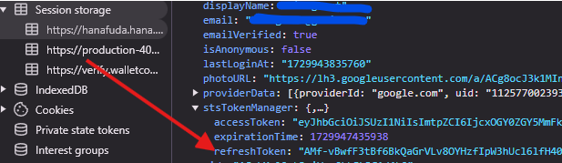

# Bot grow open garden and auto deposit ETH

A Hana Network automation bot for interacting with the Hanafuda platform, handling daily grow airdrop claims, and auto deposit.

## Features

- Automated wallet login and authentication
- Referral system tracking
- Execute transaction
- Auto grow/hours
- Auto open garden
- Proxy support for requests
- Multi-wallet support via environment variables

## Prerequisites

- Node.js v16+
- Colorama
- Web3
- Aiohttp
- EVM CLI tools (optional)
- EVM wallets

## Installation

1. Clone the repository
```bash
git clone https://github.com/LaunchAirdrop/Hanafuda.git
cd Hanafuda
```

2. Install packages
```bash
pip install -r requirements.txt
```

3. Edit and input Private Key:
```bash
nano pvkey.txt
```

4. Run the script
```bash
python3 main.py
```

choose 1 to do transactions

## Run grow and open garden boxes

**First You Need To Get Your Refresh Token**
- Open Hana Dashboard : https://hanafuda.hana.network/dashboard
- Click F12 to open console
- Find Application and choose session storage
- Select hana and copy your refreshToken

- Edit token.txt paste your refresh token

run the script
```bash
python3 main.py -a 2
```

# The bot will:
1. Login wallet
2. Display ETH Information
3. Process transactions
4. Monitor and display user stats

## Transaction Details


## Monitoring

The bot displays user stats every minute, including:
- Total points
- Today's points
- Hours active today

## Troubleshooting

- Ensure your private keys are in Base58 format
- Verify your wallets
- Check proxy formats if using proxies
- Monitor console for error messages

## License

MIT License - See LICENSE file for details

## Disclaimer

This bot is for educational purposes only. Use at your own risk. The maintainers are not responsible for any lost funds or account issues.


